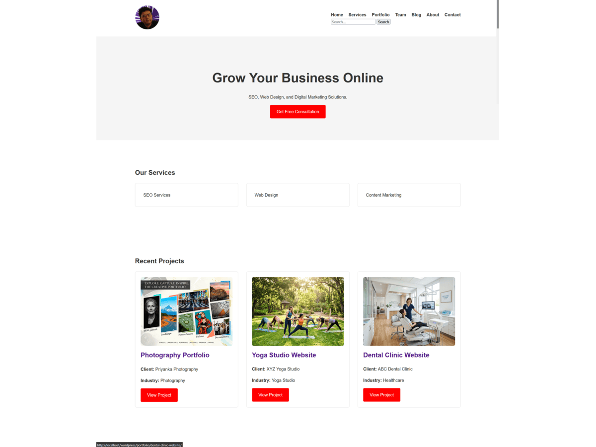

# YS Digital Marketing Agency Theme

A production-ready custom WordPress theme built from scratch to demonstrate professional WordPress theme development skills, including Custom Post Types, WP_Query, Theme Customizer API, responsive design, secure meta boxes, and scalable theme architecture.

--------------------------------------------------

OVERVIEW

YS Digital Marketing Agency Theme is a custom WordPress theme designed for:

- Digital Marketing Agencies
- SEO Agencies
- Web Design Agencies
- Freelancers
- Consultants

The project was developed without using page builders such as Elementor, Divi, or WPBakery.

Its primary goal is to showcase real-world WordPress development skills for remote WordPress Developer positions and freelance opportunities.

--------------------------------------------------

PROJECT GOALS

This project demonstrates the ability to:

- Build a custom WordPress theme from scratch
- Understand WordPress template hierarchy
- Develop reusable template parts
- Create Custom Post Types
- Create secure Meta Boxes
- Work with WP_Query
- Build responsive layouts
- Use the WordPress Customizer API
- Follow WordPress coding standards
- Implement WordPress security best practices
- Organize scalable theme architecture
- Use Git and GitHub professionally

--------------------------------------------------

FEATURES

HOMEPAGE

Custom homepage containing:

- Hero Section
- Services Section
- Portfolio Section
- Testimonials Section
- Team Section
- Blog Preview Section
- Call To Action Section

BLOG SYSTEM

- Blog Archive Page
- Single Post Page
- Category Archive Page
- Search Results Page
- Pagination
- Featured Images

PORTFOLIO SYSTEM

Custom Post Type:

- Portfolio

Custom Fields:

- Client Name
- Project URL
- Industry
- Technologies Used

Templates:

- Portfolio Archive
- Single Portfolio Page

TEAM MEMBERS SYSTEM

Custom Post Type:

- Team Members

Custom Fields:

- Position
- LinkedIn URL

Templates:

- Team Archive
- Single Team Member Page

TESTIMONIALS SYSTEM

Custom Post Type:

- Testimonials

Custom Fields:

- Client Name
- Company Name
- Rating

Templates:

- Testimonials Archive
- Single Testimonial Page

THEME CUSTOMIZER

Custom Settings:

- Primary Color
- Secondary Color
- Footer Text
- Contact Email
- Contact Phone

ADDITIONAL FEATURES

- Custom Logo Support
- Navigation Menus
- Widget Areas
- Search Functionality
- Custom Image Sizes
- Responsive Design
- 404 Page Template

--------------------------------------------------

WORDPRESS CONCEPTS DEMONSTRATED

- WordPress Template Hierarchy
- Custom Post Types (CPT)
- Custom Meta Boxes
- WP_Query
- Theme Customizer API
- Theme Supports
- Navigation Menus
- Widget Areas
- Featured Images
- Custom Image Sizes
- Search Functionality
- Archive Templates
- Single Templates
- Category Archives
- Responsive Design
- Reusable Template Parts
- Modular Theme Architecture

--------------------------------------------------

SKILLS DEMONSTRATED

WORDPRESS THEME DEVELOPMENT

- Theme Setup
- Template Hierarchy
- Template Parts
- Theme Supports
- Menus
- Widgets
- Search Forms

WORDPRESS DEVELOPMENT

- Custom Post Types
- Custom Fields
- Meta Boxes
- WP_Query
- Theme Customizer API
- Dynamic Content Rendering

FRONTEND DEVELOPMENT

- HTML5
- CSS3
- CSS Grid
- Flexbox
- Responsive Design
- JavaScript

BACKEND DEVELOPMENT

- PHP
- WordPress Hooks
- WordPress APIs
- Secure Data Handling

--------------------------------------------------

SECURITY FEATURES

The theme follows WordPress security best practices:

- Nonce Verification
- Capability Checks
- Input Sanitization
- Output Escaping
- Secure URL Handling
- Safe Data Storage

Functions used:

- sanitize_text_field()
- sanitize_email()
- sanitize_hex_color()
- esc_html()
- esc_attr()
- esc_url()
- wp_verify_nonce()

--------------------------------------------------

TECHNOLOGIES USED

- WordPress
- PHP
- HTML5
- CSS3
- JavaScript
- MySQL

No page builders were used.

--------------------------------------------------

PROJECT STRUCTURE

ys-digital-marketing-agency-theme/

├── style.css
├── functions.php

├── header.php
├── footer.php
├── sidebar.php

├── front-page.php
├── home.php
├── page.php
├── single.php
├── archive.php
├── category.php
├── search.php
├── index.php
├── 404.php

├── archive-portfolio.php
├── single-portfolio.php

├── archive-team.php
├── single-team.php

├── archive-testimonial.php
├── single-testimonial.php

├── searchform.php
├── screenshot.png

├── inc/
│   ├── theme-setup.php
│   ├── enqueue-scripts.php
│   ├── helpers.php
│   ├── customizer.php
│   ├── customizer-styles.php
│   ├── custom-fields.php
│   ├── custom-post-types.php
│   ├── team-post-type.php
│   ├── testimonial-post-type.php
│   ├── security.php
│   └── widgets.php

├── assets/
│   ├── css/
│   ├── js/
│   └── images/

├── template-parts/
│   ├── homepage/
│   ├── blog/
│   ├── portfolio/
│   ├── team/
│   └── testimonial/

└── languages/

--------------------------------------------------

INSTALLATION

1. Download or clone the repository.

2. Copy the theme folder into:

wp-content/themes/

3. Activate the theme from:

WordPress Admin → Appearance → Themes

4. Create the following pages:

- Home
- Blog

5. Configure Reading Settings:

Settings → Reading

Homepage:
Home

Posts Page:
Blog

6. Configure menus, widgets, and customizer settings.

--------------------------------------------------

USAGE

PORTFOLIO

Navigate to:

Portfolio → Add New

Add project details and featured images.

TEAM MEMBERS

Navigate to:

Team Members → Add New

Add team member details and profile images.

TESTIMONIALS

Navigate to:

Testimonials → Add New

Add client testimonials and ratings.

THEME CUSTOMIZER

Navigate to:

Appearance → Customize

Update:

- Theme Colors
- Footer Text
- Contact Email
- Contact Phone

--------------------------------------------------

FUTURE IMPROVEMENTS

Planned enhancements:

- Custom Taxonomies
- AJAX Search
- Portfolio Filtering
- Gutenberg Blocks
- Translation Ready Support
- Accessibility Improvements
- Performance Optimization
- Automated Testing

--------------------------------------------------

AUTHOR

Yudhishter Sukhija

Website: https://yudhishtersukhija.com

--------------------------------------------------

LICENSE

This project is licensed under the GPL-2.0-or-later License.

See the LICENSE file for details.
